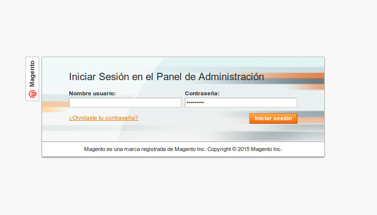
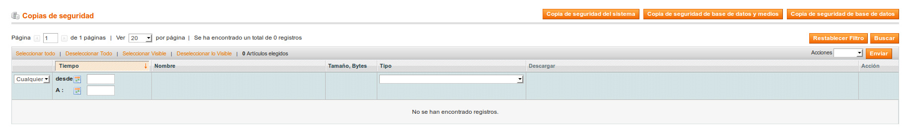
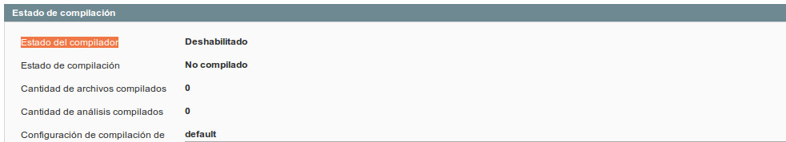
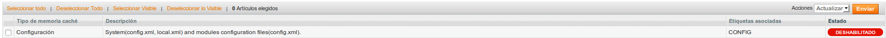
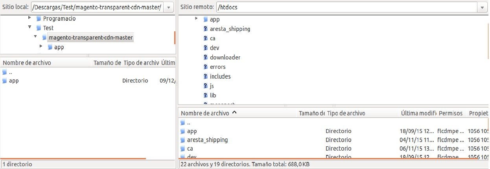
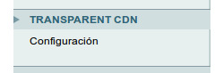
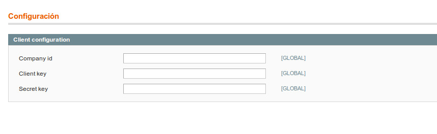

# magento-plugin
Plugin de invalidado de cache en publicaciones para Magento

## Instalación y configuración
Guia para instalar un módulo de Magento de forma manual
1. Ir a la administración de nuestra web Magento
www.baseUrl.com/admin

2. Ir a Sistema → Herramientas → Copias de seguridad
Es importante tener un backup de la web por si se rompe algo durante la instalación.

3. Ir a Sistema → Herramientas → Compilación
En este punto tenemos que asegurarnos que el estado del compilador está deshabilitado.
Si no lo está lo deshabilitaremos para la instalación.

4. Ir a Sitema → Gestión de cache
Es importante desactivar la cache de los archivos de configuración. Esto lo hacemos para que
Magento tenga en cuenta los nuevos archivos de configuración que subiremos via Filezilla.

5. Descomprimir módulo en una carpeta local
6. Abrir Filezilla y conectarnos a nuestro servidor
** Subir el código de la carpeta app de nuestro plugin a la carpeta app de nuestra web en el
servidor.

7. Hacer log out de la administración de la web y volver a entrar en ella.
Ir a Sistema → Configuración y buscar nuestro plugin en la columna de la izquierda.

8. Entrar en configuración y llenar los campos requeridos

9. Guardamos la configuración y restablecemos las opciones que hayamos deshabilitado.
Con estos pasos nuestro nuevo módulo ya estará listo para ser usado.
